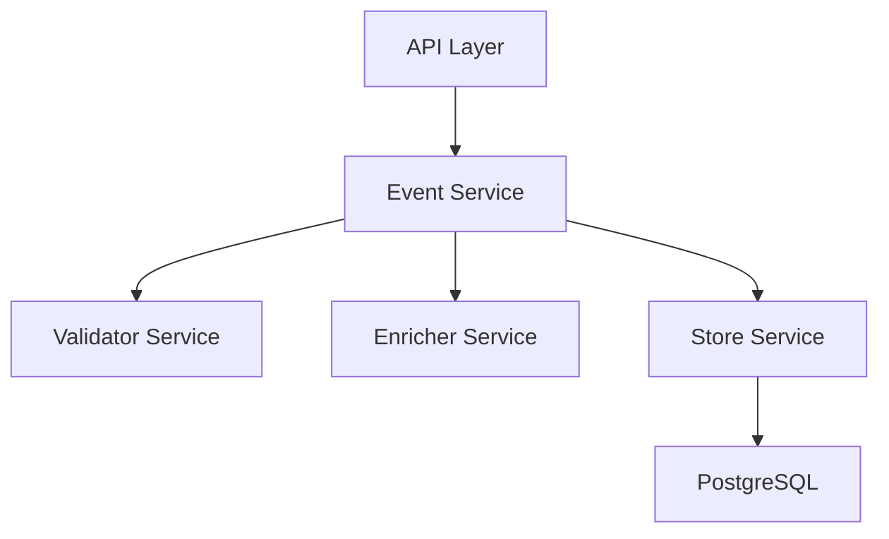

# Event Manager Service

## Overview
The Event Manager Service is an event collection and storage system designed to capture and process events from various parts of your application ecosystem. It provides a centralized way to collect, validate, enrich, and store events for later analysis.

## Architecture

### Core Components



1. **Event Controller** (`src/events/events.controller.ts`)
   - Handles HTTP requests
   - Exposes endpoints for event creation and health checks
   - Validates incoming requests

2. **Event Service** (`src/events/events.service.ts`)
   - Orchestrates event processing
   - Coordinates between validator, enricher, and store services

3. **Validator Service** (`src/events/services/event-validator.service.ts`)
   - Validates event structure and payload
   - Uses Zod schemas for type-safe validation
   - Supports custom validation per event type

4. **Enricher Service** (`src/events/services/event-enricher.service.ts`)
   - Adds metadata to events
   - Generates UUIDs for tracking
   - Timestamps events

5. **Store Service** (`src/events/services/event-store.service.ts`)
   - Handles batch processing of events
   - Manages database transactions
   - Implements retry logic

### Database Schema

```sql
CREATE TABLE events (
    id UUID PRIMARY KEY,
    event_type VARCHAR NOT NULL,
    event_version INT NOT NULL,
    payload JSONB NOT NULL,
    origin VARCHAR NOT NULL,
    correlation_id UUID,
    created_at TIMESTAMP DEFAULT CURRENT_TIMESTAMP
);
```

### Event Flow
1. Event received via HTTP POST
2. Event structure validated
3. Event enriched with metadata
4. Event added to batch
5. Batch processed and stored in database
6. Response returned with event ID and correlation ID

## Setup and Installation

### Prerequisites
- Node.js 18+
- Docker and Docker Compose
- PostgreSQL 14+

### Environment Variables
```env
POSTGRES_HOST=postgres
POSTGRES_PORT=5432
POSTGRES_USER=eventuser
POSTGRES_PASSWORD=eventpass
POSTGRES_DB=eventdb
PORT=3000
NODE_ENV=development
```

### Installation
```bash
# Clone repository
git clone [repository-url]

# Install dependencies
npm install

# Start development environment
docker-compose up -d
```

## Development Commands

### Running the Application
```bash
# Development mode
npm run start:dev

# Production mode
npm run start

# Debug mode
npm run start:debug
```

### Testing
```bash
# Unit tests
npm test

# Watch mode
npm run test:watch

# Test coverage
npm run test:cov

# E2E tests
npm run test:e2e
```

### Code Quality
```bash
# Lint check
npm run lint

# Lint fix
npm run lint:fix

# Format code
npm run format
```

## API Documentation

### POST /events
Create a new event.

Request:
```json
{
  "event_type": "credit_reset",
  "event_version": 1,
  "payload": {
    "remaining_credits": 100,
    "reset_reason": "monthly_reset"
  },
  "origin": "billing-service"
}
```

Response:
```json
{
  "status": "success",
  "event_id": "uuid",
  "correlation_id": "uuid"
}
```

### GET /events/health
Health check endpoint.

Response:
```json
{
  "status": "ok",
  "timestamp": "2025-02-13T20:22:08.011Z",
  "version": "1.0"
}
```

## Database Management

### Connecting to Database
```bash
# Connect to main database
docker-compose exec postgres psql -U eventuser -d eventdb

# Connect to test database
docker-compose exec postgres_test psql -U eventuser -d eventdb_test
```

## Project Structure
```
event-manager/
├── src/
│   ├── main.ts                  # Application entry point
│   ├── events/
│   │   ├── events.controller.ts # HTTP request handling
│   │   ├── events.service.ts    # Business logic
│   │   ├── events.module.ts     # Module configuration
│   │   ├── event.entity.ts      # Database entity
│   │   └── services/
│   │       ├── event-validator.service.ts
│   │       ├── event-enricher.service.ts
│   │       └── event-store.service.ts
│   └── config/
│       └── configuration.ts     # Configuration management
├── test/                        # Test files
├── docker/                      # Docker configuration
├── package.json
├── tsconfig.json
└── docker-compose.yml
```
